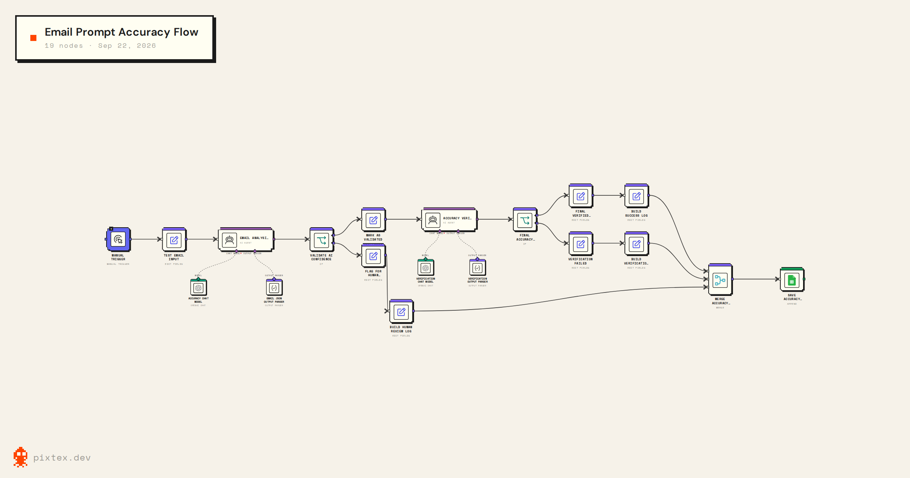

# AI Email Accuracy & Hallucination Detection Workflow

An AI email reliability workflow built in **n8n** that validates LLM-generated email analysis through structured outputs, confidence gating, human-review escalation, independent AI verification, and audit logging before allowing downstream automation.



*Workflow visualization created with Pixtex; workflow designed and implemented in n8n.*

## The Problem

LLMs can generate responses that sound confident and plausible while containing assumptions or information that is not supported by the original input.

In an automated email workflow, this creates a product risk: an incorrect interpretation can pass directly into downstream automation.

This project explores a different question:

> **How can an AI workflow decide when an LLM output is trustworthy enough to continue automatically, and when it should stop or escalate?**

Rather than relying on a single model response, the workflow introduces multiple reliability controls around the AI:

- Structured email analysis
- Explicit representation of uncertainty
- Confidence-based routing
- Human-review escalation
- Independent AI verification
- Deterministic validation gates
- Audit logging for test and prompt tracking

## The Solution

The workflow adds a reliability layer between AI-generated email analysis and downstream automation.

Instead of treating the first LLM response as automatically correct, the system evaluates whether the output should proceed, be escalated to a human, or be rejected by an independent verification step.

### How It Works

1. **Email Input**  
   A controlled test email enters the workflow with fields such as sender, subject, email body, timestamp, and test-case ID.

2. **AI Email Analysis**  
   The first AI agent analyzes the email and returns structured fields including intent, urgency, summary, customer request, confidence, and whether human review is required.

3. **Confidence Gate**  
   An n8n IF node checks:
   - `confidence >= 0.8`
   - `needs_human_review = false`

   Emails that do not satisfy both conditions are routed to **human review**.

4. **Independent AI Verification**  
   Outputs that pass the first gate are evaluated by a second AI agent. The verifier compares the analysis against the original email and checks for unsupported claims, incorrect intent, incorrect urgency, misleading summaries, and contradictions.

5. **Final Accuracy Gate**  
   The workflow proceeds only when:
   - `is_accurate = true`
   - `verification_score >= 0.8`

   Otherwise, the output is marked as a **verification failure**.

6. **Audit Logging**  
   Success, human-review, and verification-failure outcomes are merged and logged to Google Sheets with fields including test-case ID and prompt version.

### Workflow Outcomes

The system produces three primary outcomes:

- `success` — analysis passed both validation stages
- `human_review` — the initial analysis was too uncertain to continue automatically
- `verification_failed` — independent verification identified a reliability issue

## Architecture

The workflow separates **AI judgment** from **deterministic workflow control**.

The LLMs handle semantic tasks such as interpreting the email and evaluating whether an analysis is supported by the source text. n8n IF nodes handle the actual routing decisions using explicit thresholds and Boolean conditions.

```text
Email Input
    ↓
AI Email Analysis
    ↓
Confidence Gate
    ├── Uncertain → Human Review → Log
    │
    └── Pass → Independent AI Verification
                    ↓
               Final Accuracy Gate
                    ├── Pass → Verified Output → Log
                    └── Fail → Verification Failed → Log
                                                    ↓
                                             Google Sheets

## AI Reliability Design

The workflow uses multiple controls instead of relying on a single LLM response.

### 1. Structured Outputs

The first AI agent returns a defined set of fields:

- `intent`
- `urgency`
- `summary`
- `customer_request`
- `confidence`
- `needs_human_review`
- `reason`

This makes the model output easier to validate and route through deterministic workflow logic.

### 2. Explicit Uncertainty

The urgency field supports:

`low / medium / high / unspecified`

The `unspecified` state was added after testing showed that forcing the model to choose between only low, medium, and high could create unsupported assumptions.

### 3. Human Review

If confidence is below `0.8` or `needs_human_review` is `true`, the workflow stops the automated path and routes the case for human review.

### 4. Independent Verification

A second AI agent evaluates the first agent's analysis against the original email.

Before verifying the output, it identifies:

- The problem explicitly reported
- The action explicitly requested
- The urgency explicitly supported
- Information that is absent from the email

This helps separate source-grounded facts from plausible but unsupported assumptions.

### 5. Deterministic Final Gate

The final routing decision is handled by n8n rather than the LLM itself.

The verified path requires:

- `is_accurate = true`
- `verification_score >= 0.8`

## Evaluation & Product Iteration

The workflow was tested using manually constructed scenarios designed to expose both normal behavior and AI failure modes.

| Scenario | Expected Outcome | What Happened | Iteration |
|---|---|---|---|
| Clear billing/refund request | Success | Passed validation and verification | No change required |
| Ambiguous customer request | Human review | Initially classified with too much confidence | Tightened the prompt to escalate underspecified emails |
| Deliberately unsupported claim | Verification failure | Independent verifier detected the unsupported claim | Confirmed the verification branch could catch this test condition |
| Delayed package with no stated urgency | Success without inferred urgency | Model initially assigned `medium` urgency and verification failed | Added `unspecified` to the urgency schema and retested successfully |

### Key Product Learning

One of the most useful failures came from the delayed-package test.

The model assigned `medium` urgency even though the customer had not expressed urgency. The issue was not simply the prompt. The output schema itself only allowed:

`low / medium / high`

By adding `unspecified`, the system could represent uncertainty instead of forcing the model to make an unsupported classification.

This changed the design principle from:

> "Make the model choose the best answer."

to:

> "Give the system a valid way to represent when the evidence does not support an answer."

Detailed test documentation is available in [`evaluation/test-results.md`](evaluation/test-results.md).

## Product Decisions & Trade-offs

### Reliability vs. Automation Rate

Stricter confidence and verification rules can route more emails to human review. This reduces automation coverage, but avoids automatically proceeding when the system is uncertain.

### Reliability vs. System Complexity

Using two AI calls plus a human-review branch makes the workflow more complex than a single-agent automation. The additional verification layer was intentionally included to explore reliability before downstream actions are allowed.

### AI Judgment vs. Deterministic Control

LLMs are used for semantic interpretation, while n8n IF nodes control routing through explicit conditions. This keeps workflow decisions observable rather than allowing the model to control the entire automation path.

### Representing Uncertainty vs. Forcing Classification

Adding `unspecified` creates another state for downstream systems to handle, but prevents the urgency schema from forcing unsupported classifications.

### Reliability Before Integration

The workflow currently uses controlled test inputs rather than a live Gmail trigger. This was intentional so the core AI reliability logic could be tested before adding external integration complexity.

## Limitations

This is a prototype focused on validating the reliability workflow rather than production deployment.

Current limitations include:

- Small, manually created test set
- No quantitative accuracy benchmark
- No production Gmail integration
- No real human-review interface
- No latency or cost analysis
- AI verification can also make mistakes

## Next Steps

The next iteration would focus on:

1. Connect Gmail through a normalized input layer
2. Build a larger labeled evaluation dataset
3. Add automated regression testing
4. Measure false approvals, escalations, latency, and cost
5. Add a human-review interface and feedback loop
6. Compare prompt versions and reliability over time

## Repository Structure

```text
ai-email-reliability-n8n/
├── README.md
├── workflow/
│   └── ai-email-accuracy-workflow.json
├── prompts/
│   ├── email-analysis-prompt.md
│   └── verification-prompt.md
├── evaluation/
│   ├── test-cases.csv
│   └── test-results.md
└── docs/
    ├── workflow-architecture.png
    └── n8n-workflow.png
```

The workflow JSON is sanitized for public sharing. Credentials and account-specific identifiers are not included.

## What I Learned

This project reinforced that reliable AI automation depends on more than prompt quality.

The key product lesson was to design the system around uncertainty: define what the model is allowed to conclude, provide a way to represent missing information, create clear escalation paths, and test failure cases before expanding automation.

It also demonstrated the value of combining probabilistic AI reasoning with deterministic workflow controls.
